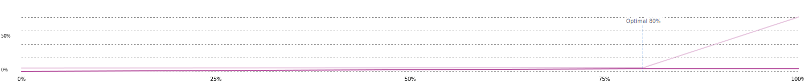

## Reserves

### Reserves altered

| key | value |
| --- | --- |
| interestRateStrategy | ~~~~ |
| reserveFactor | ~~1 %~~1.5 % |


| key | value |
| --- | --- |
| interestRateStrategy | ~~~~ |


| key | value |
| --- | --- |
| interestRateStrategy | ~~~~ |


### Raw diff

```json
{
  "reserves": {
    "0xFd086bC7CD5C481DCC9C85ebE478A1C0b69FCbb9": {
      "interestRateStrategy": {
        "from": "0x41B66b4b6b4c9dab039d96528D1b88f7BAF8C5A4",
        "to": "0xA9F3C3caE095527061e6d270DBE163693e6fda9D"
      }
    },
    "0xD22a58f79e9481D1a88e00c343885A588b34b68B": {
      "interestRateStrategy": {
        "from": "0x41B66b4b6b4c9dab039d96528D1b88f7BAF8C5A4",
        "to": "0xA9F3C3caE095527061e6d270DBE163693e6fda9D"
      }
    },
    "0x82aF49447D8a07e3bd95BD0d56f35241523fBab1": {
      "interestRateStrategy": {
        "from": "0x9b34E3e183c9b0d1a08fF57a8fb59c821616295f",
        "to": "0x27eFE5db315b71753b2a38ED3d5dd7E9362ba93F"
      },
      "reserveFactor": {
        "from": 1000,
        "to": 1500
      }
    }
  },
  "strategies": {
    "0x27eFE5db315b71753b2a38ED3d5dd7E9362ba93F": {
      "from": null,
      "to": {
        "baseStableBorrowRate": "68000000000000000000000000",
        "maxExcessStableToTotalDebtRatio": "800000000000000000000000000",
        "address": "0x27eFE5db315b71753b2a38ED3d5dd7E9362ba93F",
        "baseVariableBorrowRate": "10000000000000000000000000",
        "stableRateSlope2": "800000000000000000000000000",
        "optimalUsageRatio": "800000000000000000000000000",
        "variableRateSlope2": 100000000,
        "optimalStableToTotalDebtRatio": "200000000000000000000000000",
        "maxExcessUsageRatio": "200000000000000000000000000",
        "stableRateSlope1": "40000000000000000000000000",
        "variableRateSlope1": "38000000000000000000000000"
      }
    }
  }
}
```